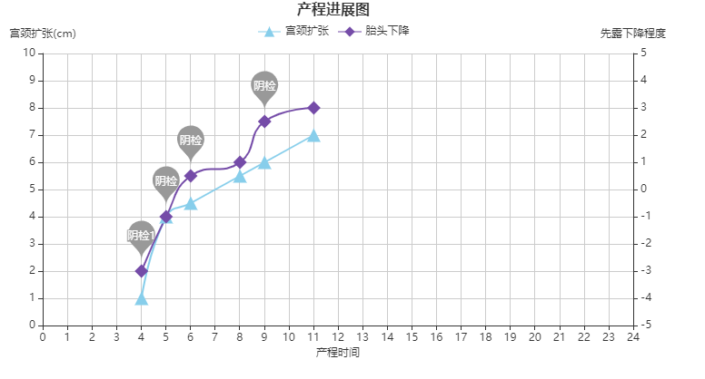
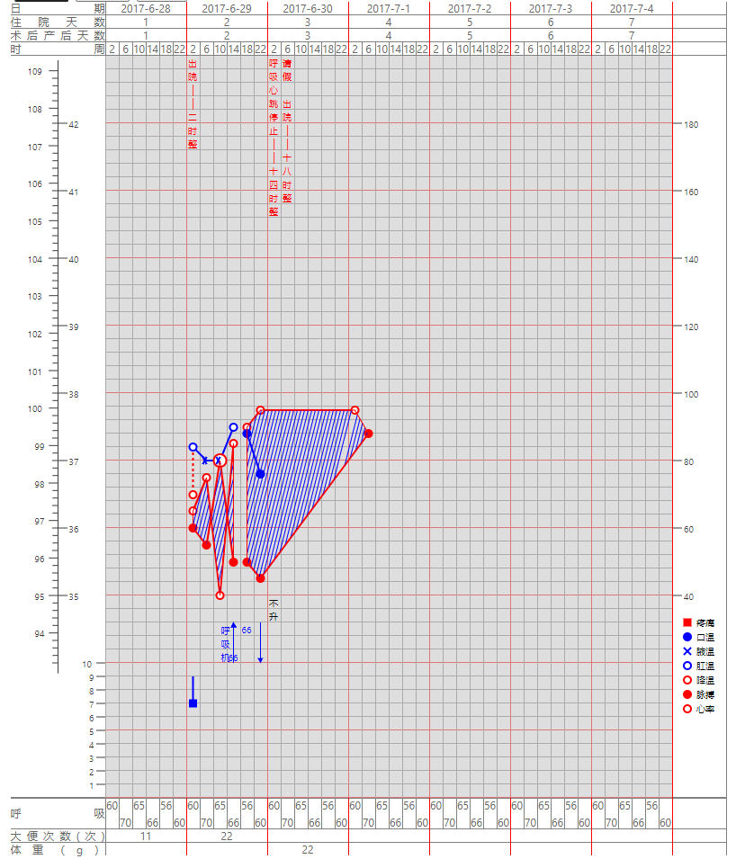

### react-medical-charts


### Installation

**npm**

```bash
npm install react-medical-charts --save
```

**yarn**

```bash
yarn add react-medical-charts --sava
```

### Usage
#### partogram-chart
[document](docs/partogram.md)

[playGround](https://codesandbox.io/s/admiring-waterfall-vrlmr?file=/src/App.js)


#### temperature-chart

[document](docs/temperature.md)

[playGround](https://codesandbox.io/s/elastic-archimedes-7o3ui)


